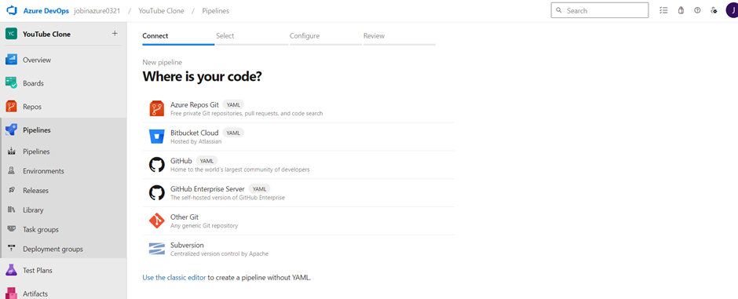
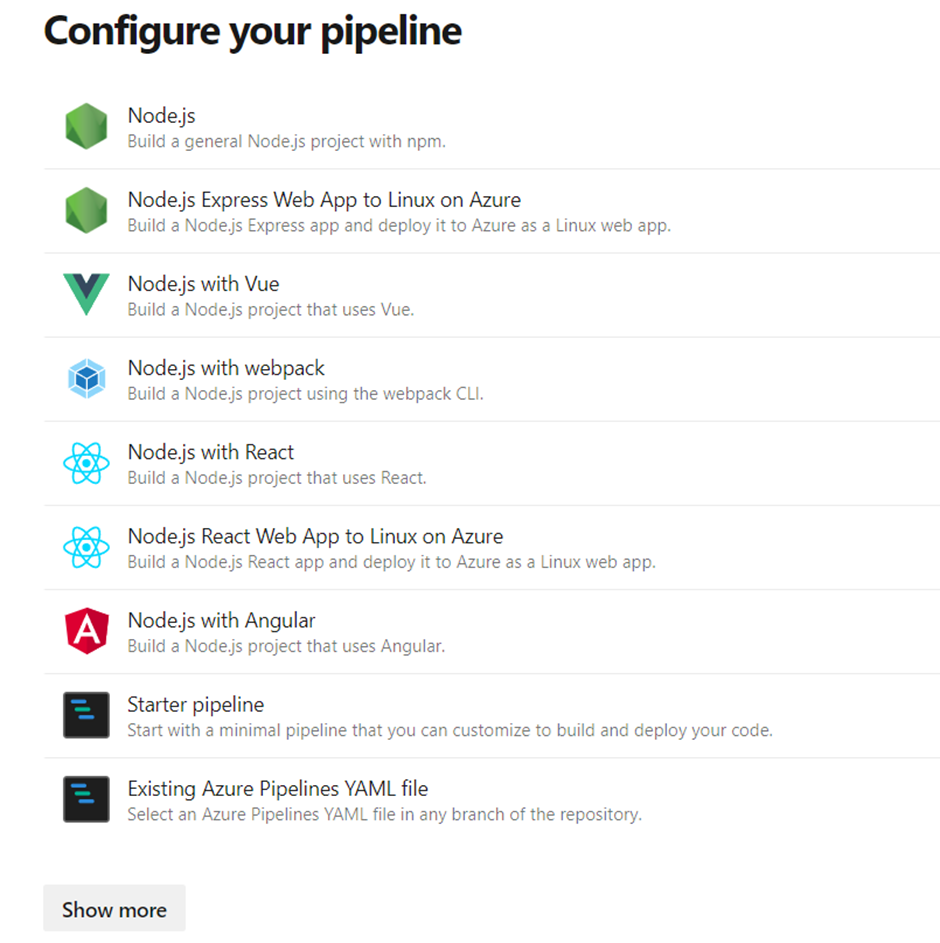
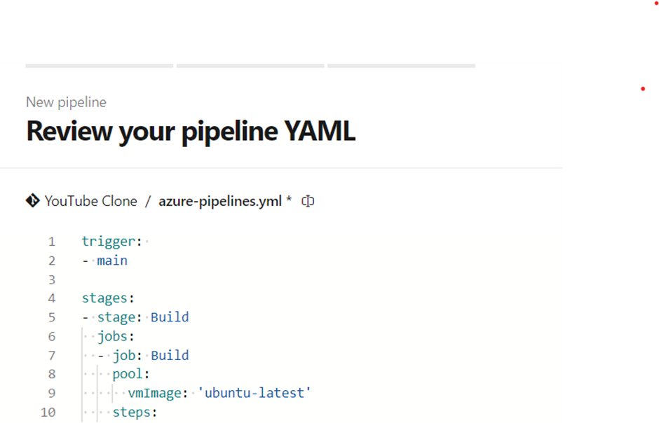
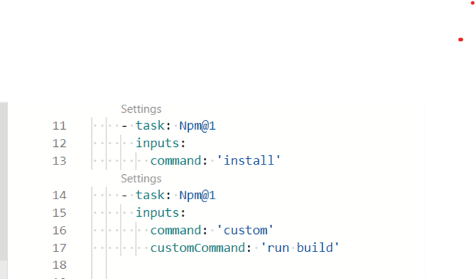
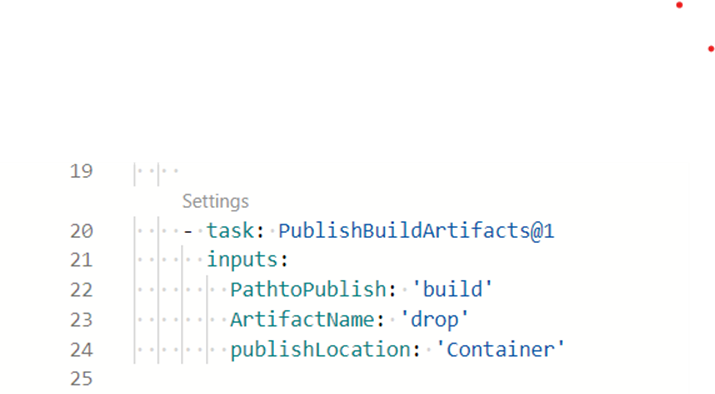
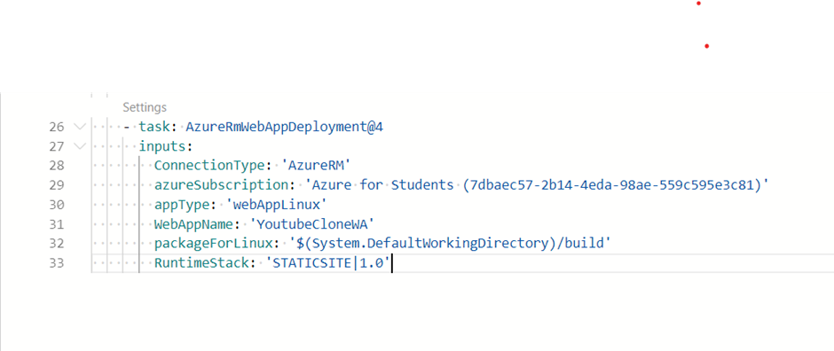
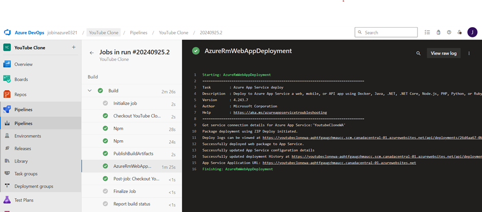
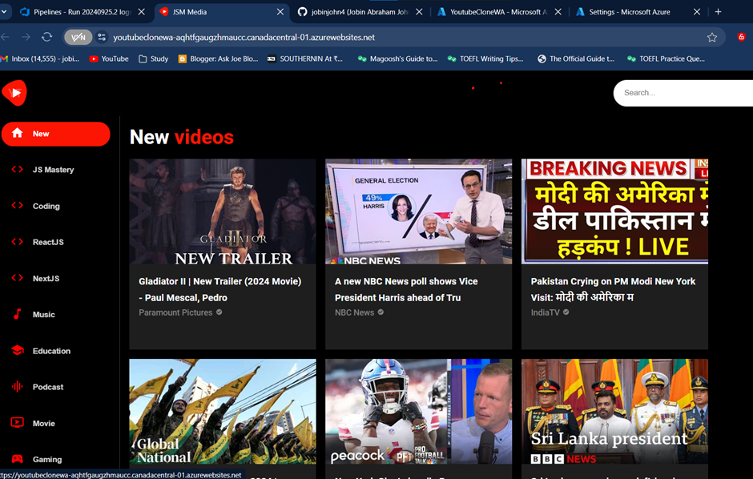

# Automating YouTube Clone Deployment: CI/CD with Azure DevOps and YAML

This project focuses on automating the deployment of a YouTube clone application using Azure DevOps and YAML-based CI/CD pipelines. It demonstrates how to integrate continuous integration (CI) and continuous deployment (CD) practices to streamline the build, and release process. By leveraging Azure DevOps, the project sets up a fully automated pipeline to deploy the application to the desired environment efficiently. The YAML configuration provides a flexible, code-driven approach to define and maintain the pipeline, ensuring consistency and scalability throughout the deployment lifecycle.
### 1. Creating new pipeline in Azure DevOps
### Selecting Existing Git repo 

## 2. In this project, we start by selecting the "Starter Pipeline" in Azure DevOps to write a custom build pipeline from scratch using YAML, providing full control over the configuration of the CI/CD process for deploying a YouTube clone.

## Creating Build Pipeline

## Adding NPM install and NPM build steps

## Also adding Publish Build Artifact

## Last step, adding Azure App Service Deploy 

## After triggering the pipeline, the build process executed successfully, confirming that all defined stages, including dependency installation, project compilation, and test execution, completed without any errors.

## After running the URL, the website is now live and accessible to users, showcasing the deployed YouTube clone application successfully
